# Skill Grove



<p>
  简体中文 | <a href="README.md">English</a>
</p>

<p>
  <a href="https://github.com/AlienHub/skill-grove/blob/main/LICENSE"></a>
  
  
  
  
  
  
</p>

Skill Grove 是一个安静、本地优先的工作台，用来理解和整理你的 Agent Skills。

多数 skill 库的问题，不是数量太少，而是慢慢变得不可见。你会把 skill 复制到 Claude、Codex、Cursor、Gemini 和各种自定义 agent 里。描述会漂移，内容会分叉，旧软链接会长期存在。过一段时间后，你已经说不清哪一版才是真的、哪一版会被加载、为什么不同 agent 的表现越来越不一样。

Skill Grove 想做的，就是把这团混乱重新变得可理解。

## 为什么要打开 Skill Grove

当你想回答下面这些问题时，Skill Grove 应该值得被打开：

- 我到底有哪些 skills，分散在哪些 agent 里？
- 哪些 skill 被重复安装了，哪些已经出现内容漂移？
- 我应该继续维护哪个真实来源？
- 距离我上次打开之后，什么发生了变化？
- 哪些 skill 值得我重新看一眼，因为它们可能影响路由、上下文或一致性？

Skill Grove 不是帮你囤积更多 skill。它的目标，是让你的个人 skill 生态重新变得清楚。

## 它能给你带来什么

Skill Grove 把 skill 看成“活着的上下文资产”，而不只是一个 `SKILL.md` 文件。

- 它把常见本地 agent 目录里的 skills 汇总到同一个库里。
- 它按内容版本和真实来源路径来组织同名 skill。
- 它把最近变化显出来，让你有回访理由。
- 它帮助你发现 skill 库里已经出现的不一致和分叉。
- 它让你能安全地执行动作：打开、编辑、分享、软链同步，或者清理重复来源，而不是做粗暴的批量删除。

## 怎么使用

Skill Grove 预期的使用循环很简单：

1. 接入本地 skill 目录，让 Skill Grove 完成扫描。
2. 在技能库里按 skill 浏览，再深入看 variant 和 source。
3. 看看哪些内容变了，哪些版本分叉了，哪些值得多看一眼。
4. 决定哪个来源应该继续作为 canonical source。
5. 安全地打开、编辑、分享、软链同步，或移除此来源。

Skill Grove 适合被频繁但轻量地打开。它应该帮助你快速重新进入上下文，而不是每次都逼你走一整套管理流程。

## 我们如何看待 Agent Skill 生态

我们不认为这个生态最需要的是另一个 marketplace，或者另一个团队管理后台。

我们认为它最需要的是更好的本地理解能力。

今天的 Agent Skill 生态天然是碎片化的：

- 不同 agent 的 skill 发现机制并不一样。
- 同一个 skill 常常同时存在于多个目录。
- 很短的一句 description 就可能改变路由行为。
- 很小的一次修改，也可能制造出一个新的内容版本，并在以后持续制造困惑。
- 大多数人并没有一个清晰的心智模型，知道自己的 agent 真实能看到什么。

Skill Grove 关注的正是这个缺口。它帮助个人用户直接查看磁盘上的真实文件，在不同 agent 之间对照它们，并逐步建立对自己 skill 库更清楚的理解。

## 产品原则

- 本地优先。不需要账号，不依赖云端，不强制同步。
- 默认克制。不做 noisy dashboard，不摆出企业控制台的姿态。
- Variant-first。内容版本比一串平铺的路径更重要。
- 把隐性的结构解释出来。Skill 会影响 agent 行为，产品就应该让这件事可见。
- 动作要安全。优先可恢复操作，并明确到 source 级别的真实意图。

## Skill Grove 不是什么

Skill Grove 不是：

- marketplace
- 公共 skill registry
- 团队治理控制台
- 批量 destructive cleanup 工具
- 完整的 skill 编写 IDE

它更像一个精致的、本地优先的 Agent Skill 资料库和工作台。

## 路线图

接下来的产品方向，会更强调用户价值、回访理由和上下文理解，而不是继续堆功能。

当前的产品定位、设计原则和阶段性路线图见 [docs/roadmap.md](docs/roadmap.md)。

## 当前能力

- 在桌面端集中浏览本地 `SKILL.md`。
- 仅在检测到对应 app 或 CLI 已安装时自动发现内置 skill 目录。
- 聚合同名 skill 的多个来源。
- 区分真实文件、软链接入口和内容一致的 variants。
- 查看最近变化、收藏重要 skills，并保留最近看过的内容。
- 以更适合阅读的方式展示长 Markdown 与 frontmatter。
- 支持用默认编辑器或 IDE 打开来源。
- 支持把真实来源以软链接形式分享到其他本地 agent，或导出 ZIP。
- 支持把重复的真实副本安全收敛为软链来源。

## 快速开始

安装依赖：

```bash
bun install
```

启动 Tauri 桌面应用：

```bash
bun run tauri:dev
```

只启动 Vite 浏览器版本：

```bash
bun run dev
```

浏览器地址：

```text
http://127.0.0.1:5176
```

## 验证

```bash
bun run typecheck
bun run build
cd src-tauri && cargo check
```

生产预览使用 `5177` 端口：

```bash
bun run preview
```

## 打包

构建 DMG：

```bash
bun run dmg
```

生成的 `.app` 位置：

```text
src-tauri/target/release/bundle/macos/Skill Grove.app
```

在 macOS 26 上，Tauri 内置 DMG wrapper 可能会在最后的 `create-dmg` 阶段失败。如果发生这种情况，可以手动把已生成的 `.app` 打成 DMG：

```bash
mkdir -p /tmp/skill-grove-dmg
cp -R "src-tauri/target/release/bundle/macos/Skill Grove.app" /tmp/skill-grove-dmg/
ln -s /Applications /tmp/skill-grove-dmg/Applications
hdiutil create -volname "Skill Grove" -srcfolder /tmp/skill-grove-dmg -ov -format UDZO \
  "src-tauri/target/release/bundle/dmg/Skill Grove_0.6.1_aarch64.dmg"
```

## Skill 目录扫描

用户配置文件：

```text
~/.agents/skill-manager.json
```

目录解析策略：

- 用户手动配置的目录始终会被规范化、去重，并在存在时参与扫描。
- 内置候选目录会在设置页里区分为已安装 Agent 和不可用 Agent。
- 内置目录只有在检测到对应 app 或 CLI 已安装且 skill 目录存在时才会参与扫描。
- 不可用 Agent 即使留下了内置目录，也不会计入 skill 统计。

当前内置候选目录：

```text
~/.agents/skills
~/.codex/skills
~/.claude/skills
~/.cursor/skills
~/.config/opencode/skills
~/.gemini/antigravity/skills
~/.config/agents/skills
~/.kilocode/skills
~/.roo/skills
~/.config/goose/skills
~/.gemini/skills
~/.copilot/skills
~/.openclaw/skills
~/.factory/skills
~/.codeium/windsurf/skills
~/.trae/skills
~/.deepagents/agent/skills
~/.firebender/skills
~/.augment/skills
~/.bob/skills
~/.codebuddy/skills
~/.commandcode/skills
~/.snowflake/cortex/skills
~/.config/crush/skills
~/.iflow/skills
~/.junie/skills
~/.kiro/skills
~/.kode/skills
~/.mcpjam/skills
~/.vibe/skills
~/.mux/skills
~/.neovate/skills
~/.openhands/skills
~/.pi/agent/skills
~/.pochi/skills
~/.qoder/skills
~/.qwen/skills
~/.trae-cn/skills
~/.zencoder/skills
~/.adal/skills
~/.hermes/skills
```

## 配置文件

示例 `~/.agents/skill-manager.json`：

```json
{
  "skillDirectories": [
    "/Users/you/.agents/skills",
    "/Users/you/.codex/skills"
  ],
  "sourceIcons": {
    "/Users/you/.agents/skills": {
      "type": "dataUrl",
      "value": "data:image/svg+xml;base64,..."
    }
  }
}
```

字段说明：

- `skillDirectories`：用户手动配置的 skill 根目录。
- `sourceIcons`：来源目录到自定义图标的映射，key 为规范化后的来源目录。
- 自定义图标优先级高于内置 `@lobehub/icons` 映射。

## 贡献

欢迎通过 Issue 或 Pull Request 参与这些方向：

- 优化大规模个人 skill 库的阅读和整理体验
- 扩展 agent 目录识别与来源元数据
- 帮助用户更清楚地理解不同 provider 下的 skill 差异
- 打磨产品语言、onboarding 和首次使用引导

提交前建议运行：

```bash
bun run typecheck
bun run build
cd src-tauri && cargo check
```

## 许可证

本项目基于 [Apache-2.0](LICENSE) 许可证开源。
